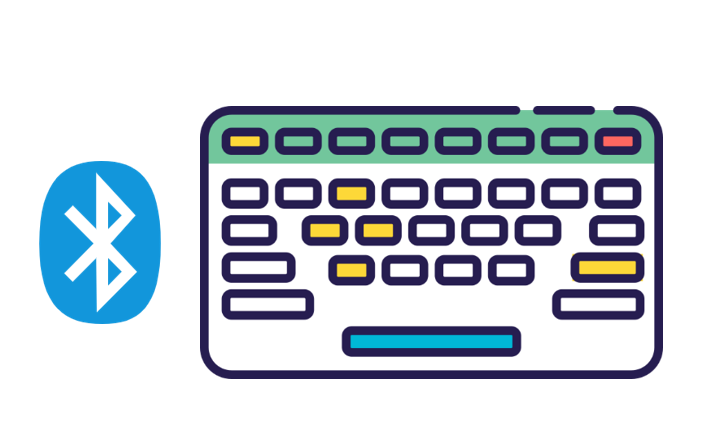
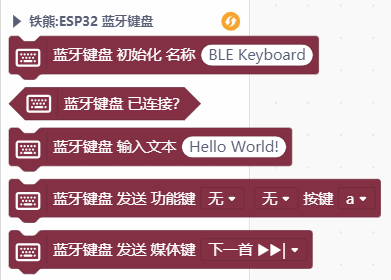
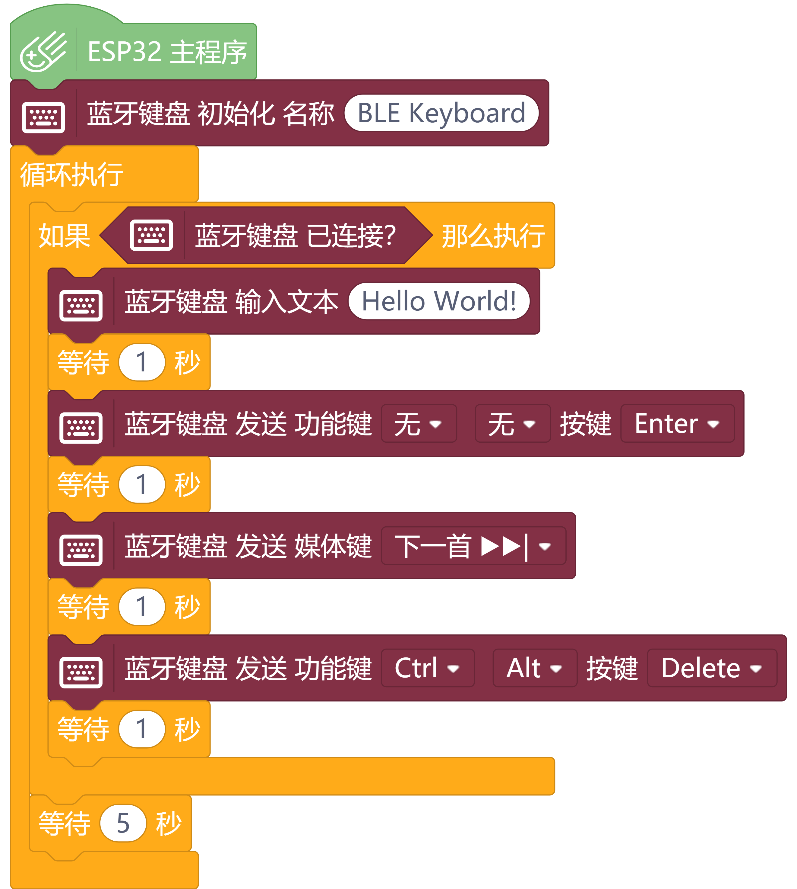

# Mind+ 扩展库：ESP32 蓝牙键盘

## 简介

本扩展库仅限在 Mind+ 软件中使用，为 ESP32（掌控板）设计，可以将掌控板模拟成蓝牙键盘，支持媒体键，可以在 Mind+ 用户库中进行导入。

## 链接

- Mind+ 库地址：[https://github.com/chenzhongxian/ext-BLEKeyboard](https://github.com/chenzhongxian/ext-BLEKeyboard)
- Arduino库：ESP32 BLE Keyboard 库地址：[https://github.com/T-vK/ESP32-BLE-Keyboard](https://github.com/T-vK/ESP32-BLE-Keyboard)
- Mind+ 软件下载地址：[http://mindplus.cc](http://mindplus.cc)
- Mind+扩展库教程：[https://mindplus.dfrobot.com.cn/extensions-user](https://mindplus.dfrobot.com.cn/extensions-user)

## Blocks

## 示例

## License

MIT

## 硬件支持

MCU                | JavaScript    | Arduino   | MicroPython    | Remarks
------------------ | :----------: | :----------: | :---------: | -----
micro:bit        |             |               |             | 
mPython(掌控版)        |             |        √      |             | 
Arduino Uno    |             |               |             | 

## 鸣谢

感谢 DFRobot **李亮** 老师提供技术支持。 

## 更新日志

- V0.1.0，20200221，第一版发布

## 关注

欢迎关注公众号：**铁熊玩创客**，不定期更新创客制作、技术教程、创客教育等相关内容。

